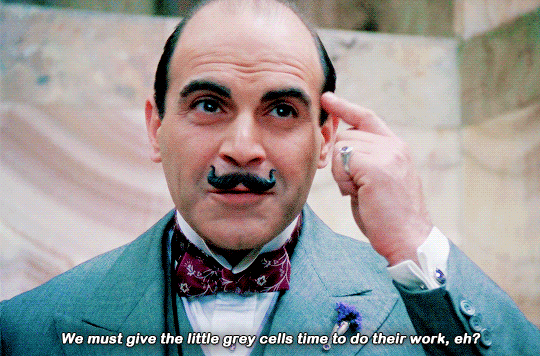

### GreyCells: Memory with a URL

**Inspiration**

In LLMs, `memory` means how the model remembers information.

It can remember things you said in the current chat (short-term memory) or keep useful info from past chats (long-term memory) to make future answers more relevant.

I came up with this project while experimenting with agentic AI frameworks like [LangGraph](https://www.langchain.com/langgraph) and [Mem0](https://mem0.ai/). I noticed that while agents can `remember` information locally, there’s no shared, persistent, or interoperable way to store and share memories online.

Imagine if agents could save thoughts and experiences just like humans save files in Dropbox, each one having a unique URL, version history, and access control.



🕵️ From [*Agatha Christie’s Poirot*](https://www.imdb.com/title/tt0094525/) with David Suchet.

**Reality**

LLM agents are becoming more capable (e.g., OpenAI’s GPTs, CrewAI, LangGraph agents), but they all store “memory” differently, usually ephemeral and isolated inside a local database. 

There is no cross-tool standard for memory sharing, exporting, or collaboration.

This makes it impossible to:

- Transfer experiences between agents (e.g., OpenAI → Claude → local agent)
- See and edit what an agent has “learned”
- Reuse memory objects across applications

**Problem**

There is no cloud layer for agent memory, something that works like Dropbox or Google Drive but for *cognitive data*.

Current tools (Mem0, Zep, Letta) handle persistence but not:

- Per-memory URLs with TTL-based sharing
- Versioning (`mem:v1`, `mem:v2`) with temporal and semantic diffs
- Open interoperability across LLM ecosystems

We can’t yet *see* how an agent’s worldview evolves or *share* its knowledge safely and granularly.

**Solution**

Build a memory cloud that stores each memory as an addressable object with its own URL, access tokens, and version history.

Each memory can be:

- Created and updated via API or SDK
- Shared via a signed link (`https://greycells.ai/m/mem_123@v2`)
- Diffed semantically to show what changed between versions
- Exported to `.memx` files for transfer between agents

Think of it as Dropbox + Git + Knowledge Graph for AI memories.

**Key behaviors**

- Store atomic memory objects (`fact`, `preference`, `trace`, `event`)
- Version them automatically (`mem:123@v1 → @v2`)
- Share with expiring signed URLs (TTL-based access)
- Diff versions both temporally (JSON patch) and semantically (embedding distance + LLM summary)
- Visualize all agent memories on a unified dashboard

#### Example (API flow)

**Create new memory**

```
POST /api/mem
{
  "owner": "user_001",
  "namespace": "team_warestack",
  "type": "habit",
  "content": "I usually start coding late at night when it’s quiet."
}
```

**Update (new version)**

```
POST /api/mem/mem_123/version
{
  "content": "I now prefer coding early in the morning with coffee instead of late at night."
}
```

**Diff between versions**

```
GET /api/mem/mem_123/diff?v=1..2
```

**Response**

```
{
  "id": "mem_123",
  "temporal": {"changed_fields": ["content"]},
  "semantic": {
    "cosine_delta": 0.34,
    "label": "strong change",
    "summary": "Work pattern shifted from night to morning; preference now includes coffee as motivation."
  }
}
```

**Share memory (24h TTL)**

```
POST /api/mem/mem_123/share
{
  "ttl_seconds": 86400,
  "scope": "read"
}
→ /s/abc123?mem=mem_123@v2&exp=1730000000&sig=HMAC...
```

**Access shared URL**

```
GET https://greycells.ai/s/abc123?mem=mem_123@v2&exp=1730000000&sig=...
→ Returns JSON memory if signature + TTL are valid
```

**Why this works:**

It gives every memory object a *shareable identity*, *temporal history*, and *semantic understanding*, something no existing system currently offers.

#### Minimal tech plan / stack

- Backend: FastAPI + PostgreSQL + `pgvector` (or Pinecone/Weaviate for embeddings)
- Storage model:
  - `memories` (lineage)
  - `memory_versions` (append-only versions)
  - `shares` (signed URLs with TTL)
- LLM integration: optional for semantic diff summarization
- Security: API keys per namespace, HMAC-signed share URLs, optional encryption
- Dashboard: Streamlit dashboard to visualize all memories, diffs, and links

#### Goal

Ship an MVP that lets any LLM agent:

1. Store, retrieve, and version its memory online.
2. Share individual memories via time-limited links.
3. Compute semantic diffs between memory versions.
4. Visualize all memories and version history in one dashboard.

#### Optional task

- Add a timeline view that shows how an agent’s worldview evolves over time using semantic drift graphs (embedding changes visualized like a Git commit tree).