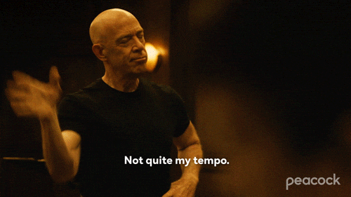
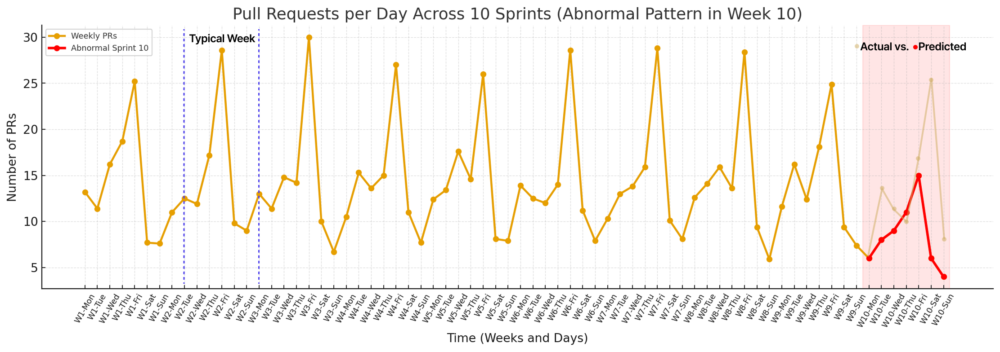

### RepoGroove: Commit with beat

**Inspiration**

This is a personal project I’ve wanted to build for a while, inspired by how engineering teams repeat weekly cycles: `code`, `review`, `merge`, `deploy`.

As a founder working with dev teams, I’ve noticed that while each week *feels* similar, the underlying workflow patterns drift over time. They might become slower or faster with lower or fewer commits for various reasons.

I haven’t had time to build it yet, but I believe this approach could give any engineering manager a measurable sense of *team rhythm* using actual repository data.

**Reality**

Teams work in weekly sprints, but rarely quantify how consistent those sprints are.

GitHub gives raw event data, commits, PRs, merges, comments, but it’s just timestamps. There’s no built-in way to model and compare the *shape* of one sprint versus another.

Imagine if every week you could generate a signal representing your team’s activity, number of PRs opened, commits made, reviews completed per day and more and then learn the rhythm of your best sprint. 

Your goal? Is to always is to either improve it or stay as close to the best.

🎬 From [*Whiplash*](https://www.imdb.com/title/tt2582802/).

**Problem**

Traditional metrics are static: averages, counts, throughput. They don’t capture *behavioural shape* whether a sprint followed the same healthy curve of activity as previous ones.

Teams only notice drift when things feel slower, not when the activity pattern silently changes. E.g. I would prefer to know Wednesday morning that this week's pattern went off, rather than next Monday morning that the new sprint starts. 

**Solution**

Build a system that turns GitHub activity into a time-series signal and compares weekly behaviour using RNNs and signal similarity analysis (e.g., Dynamic Time Warping or similar methods).

Every sprint (e.g., 7 days) becomes a sequence:

- Daily PRs opened
- Commits merged
- Reviews completed

The model learns the “ideal” pattern (typical week) from a reference week (the *perfect sprint*). Then, each new week is compared against it using time series analytics and signal similarity methods to measure how close or far the team’s behaviour was from that ideal.

When similarity drops below a threshold, the system marks it as an bad (anomalous) week, a potential signal of friction, distraction, or process drift.

### Example

**Reference week (Perfect Sprint):**

- Mon–Wed: steady PR flow (5–6/day)
- Thu: peak merges
- Fri: cleanup and reviews

**Next week:**

- Sharp drop in mid-week reviews
- Late merges spilling into weekend
- DTW similarity = 0.68 (vs. 0.92 baseline)

**Generated alert:**

> ⚠️ Team rhythm deviation detected (Similarity 0.68).

Here’s the stacked time-series chart showing all 10 sprints sequentially (each week following the next). Week 11, a `drift week`, displays an activity pattern that diverges from the expected trend.

#### Key behaviours

- Aggregate GitHub events into daily metrics (PRs opened, merged, reviewed, commented).
- Normalize weekly data into 7-point time series.
- Train an RNN (LSTM or GRU) to learn the “ideal” week pattern.
- Compute week-to-week similarity using Dynamic Time Warping, cosine distance or similar methods.
- Trigger alerts for anomalous weeks based on configurable thresholds.
- Visualize similarity scores and drift trends in a dashboard.

#### Minimal tech plan / stack

- Data: GitHub API + cron jobs for daily ingestion.
- Storage: PostgreSQL / TimescaleDB for time-series data.
- Model: Python (TensorFlow / PyTorch) for RNN training + Soft DTW or similar methods for comparison.
- Backend: FastAPI service exposing `/metrics`, `/similarity`, `/alerts`.
- Frontend: Simple streamlit dashboard to visualize weekly graphs + similarity scores.
- Integrations: Slack bot for weekly “Team Pattern Report”.

#### Goal

Ship a minimal MVP that:

1. Collects GitHub activity per week (PRs, commits, reviews).
2. Learns a baseline sprint pattern using an RNN.
3. Compares each new week to the baseline using DTW or regression metrics.
4. Flags anomalous weeks and displays similarity scores visually.